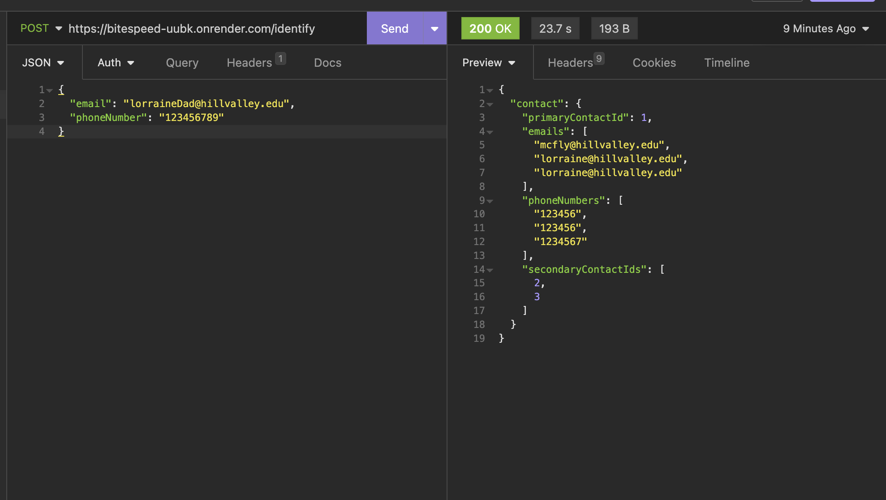

# **Identity Reconcilliation**

Test the deployed project through Postman or Insomnia or any API testing tool

[ENDPOINT](https://bitespeed-uubk.onrender.com/identify)

The request response structure is present in the image below.

The Express server is hosted on [render.com](render.com)

The Postgres database is hosted on Supabase

Contact the Author at:
https://www.linkedin.com/in/santhosh-aditya/